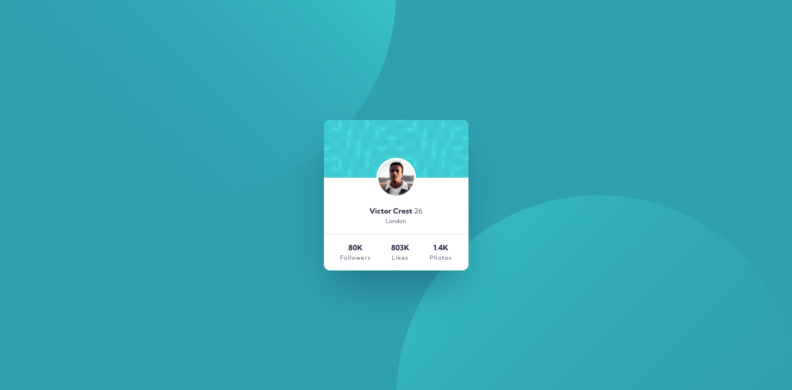
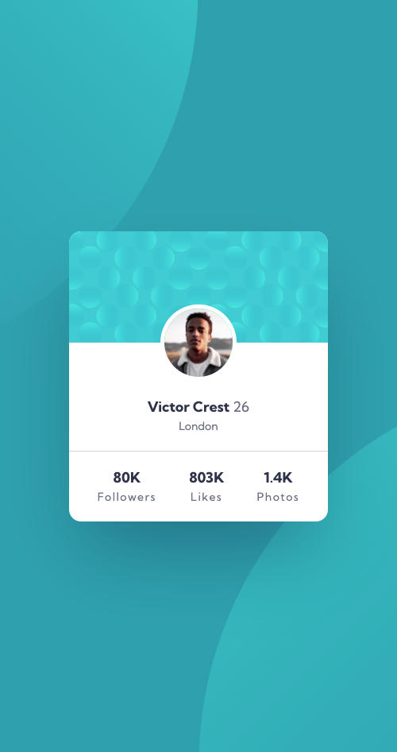

# Frontend Mentor - Profile card component solution

This is a solution to the [Profile card component challenge on Frontend Mentor](https://www.frontendmentor.io/challenges/profile-card-component-cfArpWshJ). Frontend Mentor challenges help you improve your coding skills by building realistic projects.

## Table of contents

- [Overview](#overview)
  - [The challenge](#the-challenge)
  - [Screenshot](#screenshot)
  - [Links](#links)
- [My process](#my-process)
  - [Built with](#built-with)
  - [What I learned](#what-i-learned)
- [Author](#author)

**Note: Delete this note and update the table of contents based on what sections you keep.**

## Overview

### The challenge

- Build out the project to the designs provided

### Screenshot


**Desktop Version**

  
**Mobile Version**

### Links

- Solution URL: [Solution Code](https://github.com/anhoang241998/Profile-Card_Component)
- Live Site URL: [Live Solution Website](https://an-nguyen-hoang.netlify.app/)

## My process

### Built with

- Semantic HTML5 markup
- SASS
- Flexbox
- Mobile-first workflow

### What I learned

- In this project I learned how to use SASS, FlexBox and Position to achieve the required design.

```scss
body {
  color: $color-primary-very-dark-desaturated-blue;
  background-color: $color-primary-dark-cyan;
  min-height: 100vh;
  position: relative;
  overflow: hidden;

  background-image: url("/images/bg-pattern-top.svg"),
    url("/images/bg-pattern-bottom.svg");
  background-repeat: no-repeat, no-repeat;
  background-position: right 50vw bottom 50vh, left 50vw top 50vh;
}
```

## Author

- Faceboook - [Nguyen Hoang An Facebook](https://www.facebook.com/an.nguyenhoang.10)
- Frontend Mentor - [@anhoang241998](https://www.frontendmentor.io/profile/anhoang241998)
